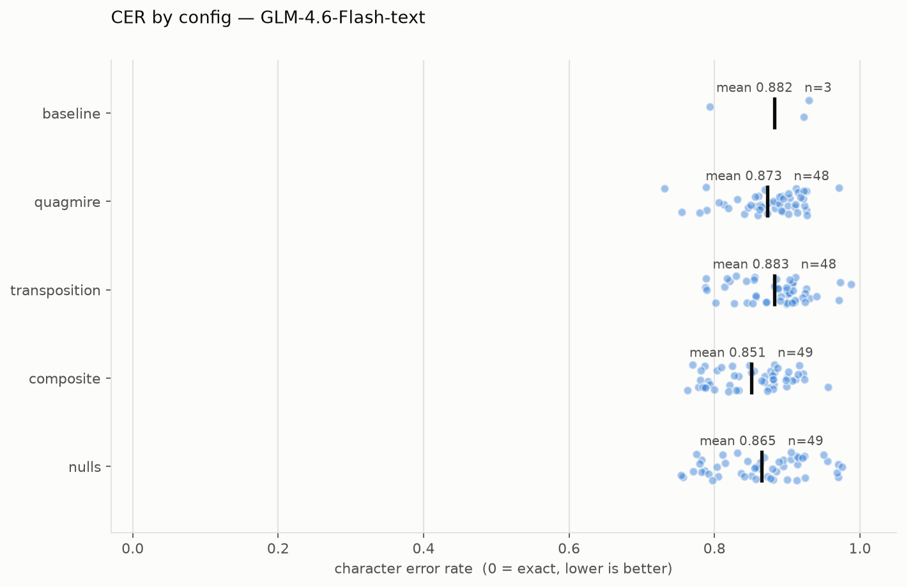
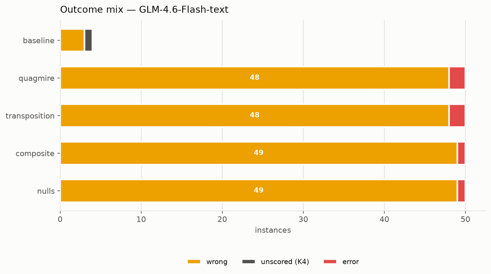

# Kryptos-bench — `sartajbhuvaji/GLM-4.6-Flash-text`

- **Run:** 2026-09-02T23:05:21+00:00
- **Serving:** vLLM on Lambda `gpu_1x_a100_sxm4`, BF16, 32768-token context
- **Axes:** paradigm `cot`, raw ciphertext, effort `unset`, default tier per row
- **Instances:** 204  (197 scored, 1 frontier, 0 refused, 6 errored)
- **Wall clock:** 10.3 min  ($0.34 of A100 time)
- **Throughput:** 127.3 output tok/s aggregate

## Per-config

```

BY CONFIG
==============================================================================
group                     n      CER     95% CI  solved  passed   cribs     fit
----------------------------------------------------------------------------
K1                        1    79.4%         --     0/1       0      --      --
K2                        1    93.0%         --     0/1       0      --      --
K3                        1    92.3%         --     0/1       0      --      --
K4                        1       --         --      --      --   0.0/4   -8.03
isomorph_composite       50    85.1%    +/-1.4%    0/49       0      --      --
                       0 refused, 1 errored (harness outcomes, excluded from the mean)
isomorph_nulls           50    86.5%    +/-1.7%    0/49       0      --      --
                       0 refused, 1 errored (harness outcomes, excluded from the mean)
isomorph_quagmire        50    87.3%    +/-1.4%    0/48       0      --      --
                       0 refused, 2 errored (harness outcomes, excluded from the mean)
isomorph_transposition   50    88.3%    +/-1.3%    0/48       0      --      --
                       0 refused, 2 errored (harness outcomes, excluded from the mean)
```

## Per-tier

```

BY TIER
==============================================================================
group    n      CER     95% CI  solved  passed   cribs     fit
-----------------------------------------------------------
2      152    86.3%    +/-0.9%   0/148       0      --      --
      0 refused, 4 errored (harness outcomes, excluded from the mean)
3       51    88.4%    +/-1.3%    0/49       0      --      --
      0 refused, 2 errored (harness outcomes, excluded from the mean)
4        1       --         --      --      --   0.0/4   -8.03
```

## Memorisation vs cryptanalysis

`baseline` is the published K1–K4. The `isomorph_*` configs are freshly generated
with novel keys and novel plaintext, so they cannot have been in training data.
A low CER on the first with a high CER on the second is recall, not cryptanalysis.

- baseline mean CER: 0.8819 +/- 0.0866  (0 exact)
- isomorph mean CER: 0.8677 +/- 0.0075  (0 exact)
- gap: +0.0142

## Caveats

- Tier pass marks are asserted by the design document, **not calibrated** against an
  observed distribution. Treat `passed` as provisional.
- `tool_use` was not run: it needs a server-side sandbox the OpenAI wire format has
  no equivalent for, so this is chain-of-thought only and is not comparable to a
  Claude `tool_use` arm.
- Cost is amortised GPU time, not a per-token tariff.




